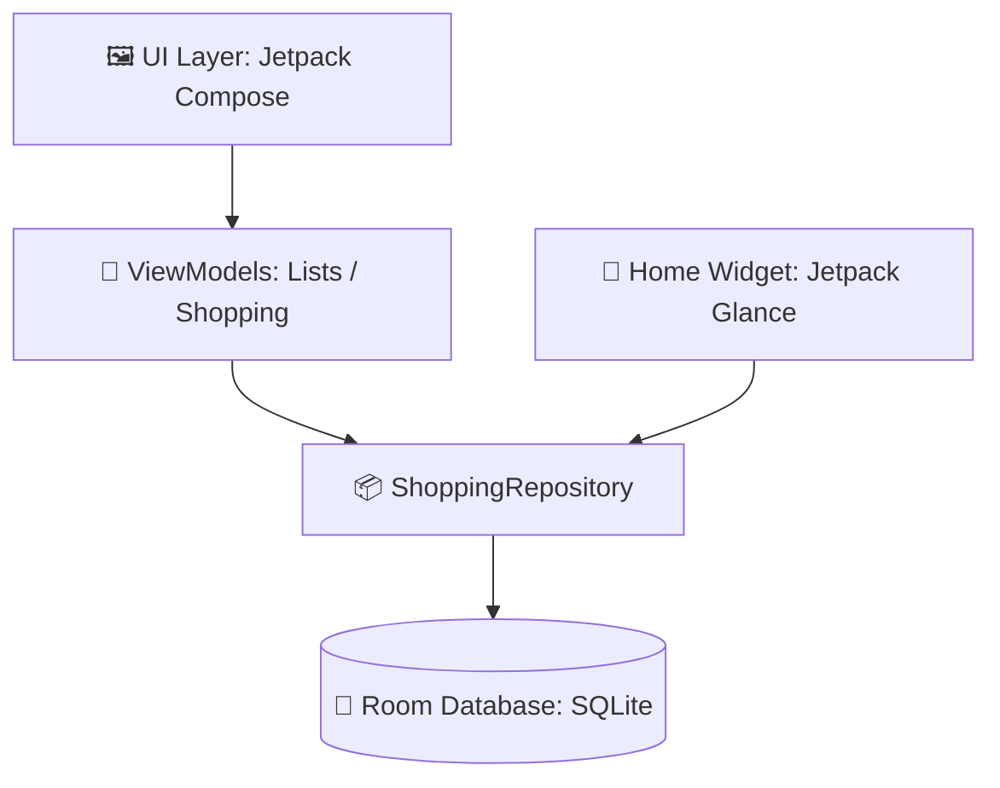

---
tags:
  - android
  - jetpack-compose
  - room-database
  - glance-widget
  - kotlin
  - app-spesa
date: 2026-06-15
status: completed
project: SpesaFacile
---

# 🛒 SpesaFacile – Documentazione Tecnica Progetto

Questa nota contiene la documentazione tecnica e l'architettura dettagliata dell'applicazione Android **SpesaFacile**, un'app nativa in lingua italiana per la gestione intuitiva e moderna della lista della spesa.

---

## 🎨 Design System & Palette Brand

Il design dell'applicazione segue le linee guida di **Material 3** ed è basato sulla palette colori estratta direttamente dal logo ufficiale (`SpesaFacileLogo.png`).

> [!success] Palette Colori (Orange/Amber Brand)
> * **Colore Primario**: `#ED840C` (Arancione vivace)
> * **Colore Secondario**: `#E25615` (Arancione scuro / accenti)
> * **Superfici & Sfondi (Light)**: `#FFFDFB` (Bianco caldo / pesca chiaro)
> * **Superfici & Sfondi (Dark)**: `#1E1B18` (Marrone scuro caldo / antracite)

### Icone dell'Applicazione
Il logo è stato scalato e ottimizzato per generare:
1. **Icona Adattiva (API 26+)**: `ic_launcher_foreground.png` (logo trasparente centrato) + `ic_launcher_background.xml` (sfondo bianco solido).
2. **Icone Legacy (Square & Round)**: generate in tutte le densità (`mdpi`, `hdpi`, `xhdpi`, `xxhdpi`, `xxxhdpi`) su sfondo circolare o quadrato arrotondato bianco.

---

## 🏗️ Architettura del Codice

L'app segue rigorosamente l'architettura **MVVM (Model-View-ViewModel)** raccomandata da Google, abbinata alla reattività dei **Flow** di Kotlin.

---

## 💾 Data Layer (Database Room)

La persistenza locale è gestita tramite **Room Database** con tre entità principali.

### 1. Entità & Modelli

*   **`ShoppingList`**: Rappresenta una lista della spesa singola (es. "Spesa Settimanale").
*   **`ShoppingItem`**: Rappresenta un prodotto appartenente a una lista, con chiavi esterne e vincolo `ON DELETE CASCADE`.
*   **`Category`**: Enum con 10 categorie predefinite in italiano, ciascuna dotata di un'icona Material specifica:
    *   `FRUTTA_VERDURA` ("Frutta e Verdura", `Icons.Outlined.Eco`)
    *   `LATTICINI` ("Latticini", `Icons.Outlined.EggAlt`)
    *   `CARNE_PESCE` ("Carne e Pesce", `Icons.Outlined.SetMeal`)
    *   `PANE_PASTA` ("Pane e Pasta", `Icons.Outlined.BakeryDining`)
    *   `BEVANDE` ("Bevande", `Icons.Outlined.LocalCafe`)
    *   `SURGELATI` ("Surgelati", `Icons.Outlined.AcUnit`)
    *   `SNACK_DOLCI` ("Snack e Dolci", `Icons.Outlined.Cookie`)
    *   `IGIENE` ("Igiene", `Icons.Outlined.Soap`)
    *   `CASA` ("Casa", `Icons.Outlined.Home`)
    *   `ALTRO` ("Altro", `Icons.Outlined.MoreHoriz`)

---

## 🖼️ UI Layer (Jetpack Compose & Screens)

L'interfaccia utente è interamente reattiva e si divide in due schermate principali gestite da **Navigation Compose**.

### 1. ListsScreen (Home)
*   Mostra tutte le liste create in una griglia/lista di card eleganti.
*   Ogni lista mostra il numero di prodotti rimasti da acquistare.
*   Pulsante **FAB (+)** per creare una nuova lista tramite un dialog interattivo.
*   Supporta la ridenominazione o l'eliminazione con una pressione prolungata (Long Press).

### 2. ShoppingScreen (Dettaglio Lista)
*   **Barra di Inserimento Rapido (`QuickAddBar`)**: Permette di digitare il nome del prodotto con autocompletamento intelligente basato sulle spese precedenti, selezionare rapidamente la categoria, regolare la quantità con tasti `+` e `-` e definire l'unità di misura (`pz`, `kg`, `g`, `l`, `ml`).
*   **Doppia Vista (Flat / Grouped)**: Consente di alternare tra la lista classica e la suddivisione automatica per reparto/categoria (con intestazioni collassabili ed icone).
*   **Prodotti Acquistati**: Sezione collassabile separata in fondo allo schermo con testo sbiadito/barrato e opzione di pulizia rapida.

---

## 📱 Widget Home Screen (Jetpack Glance)

Il widget della Home Screen permette di visualizzare i prodotti da acquistare per la lista attiva corrente direttamente dalla schermata iniziale del telefono.

> [!info] Funzionalità Widget
> *   **Checklist diretta**: Consente di spuntare i prodotti acquistati direttamente dal widget, aggiornando in tempo reale il database dell'app.
> *   **Pulsante rapido (+)**: Avvia l'app posizionando automaticamente il focus sul campo di testo dell'inserimento rapido.
> *   Realizzato tramite **Jetpack Glance** per un layout responsive e ottimizzato per il risparmio energetico.

---

## 🚀 Pipeline CI/CD (GitHub Actions)

Abbiamo configurato una build pipeline automatica tramite GitHub Actions (`.github/workflows/android.yml`).

> [!tip] Integrazione Continua (CI)
> *   **Trigger**: Si attiva ad ogni `push` o `pull_request` sul ramo `main`.
> *   **Ambiente**: Esegue il build dell'applicazione su macchina virtuale Linux con JDK 17.
> *   **Artefatto Scaricabile**: Salva e compila l'**APK finale** (`app-debug.apk`), rendendolo disponibile per il download diretto dalla scheda **Actions** sotto la voce **`SpesaFacile-APK`**.
